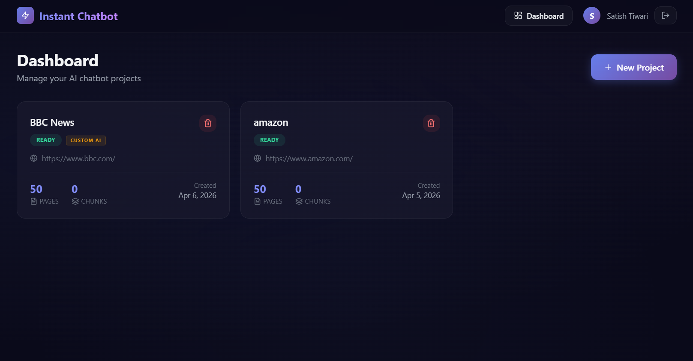
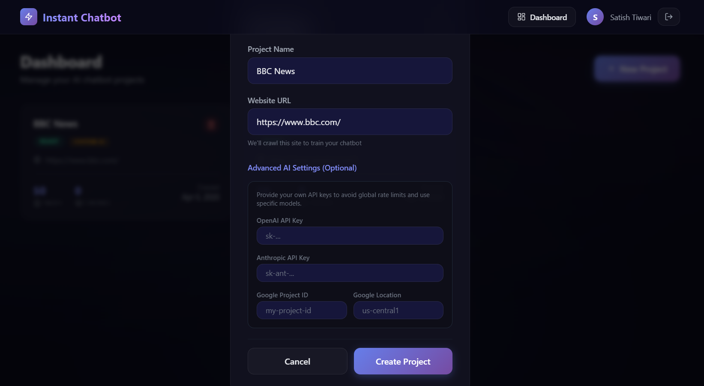
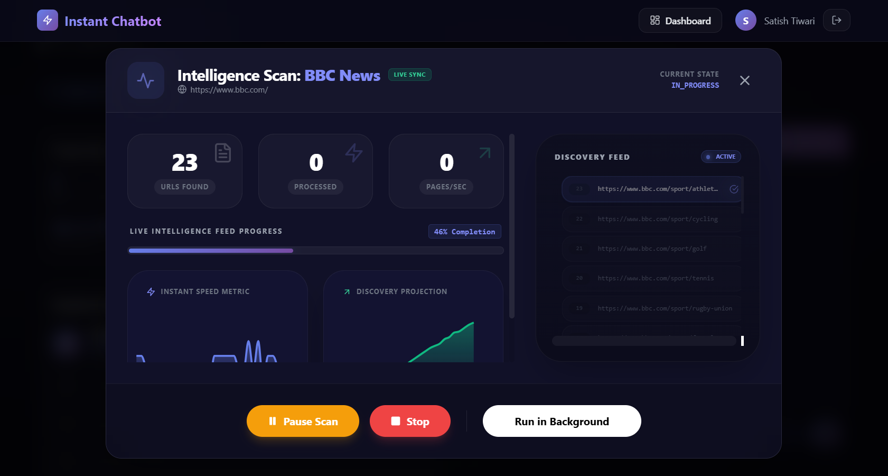
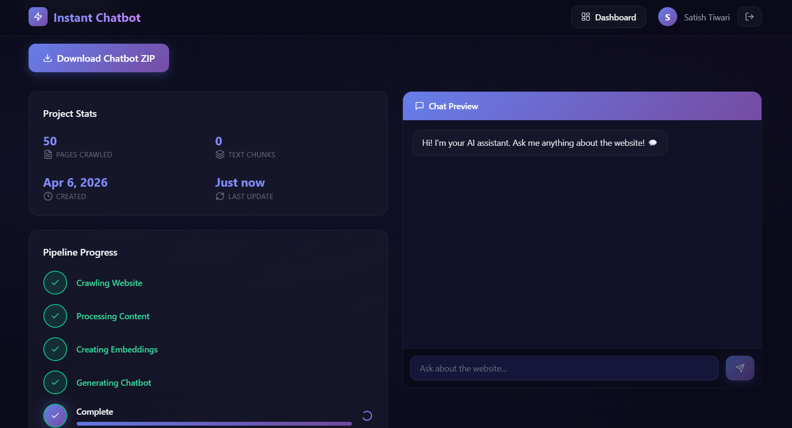

# 🤖 Instant Chatbot — AI Website Assistant

A SaaS platform that transforms any website into a deployable AI-powered chatbot. Enter a URL, and the system crawls the website, builds a RAG knowledge base using **Spring AI + PGVector**, and generates a complete chatbot package ready for deployment.

---

## ✨ Features

- **Smart Web Crawling** — Jsoup-powered crawler follows internal links + sitemap.xml
- **Content Processing** — Cleans HTML, removes boilerplate, chunks text semantically
- **Automatic AI Failover** — Self-healing RAG pipeline (OpenAI → Anthropic → Google)
- **User-Provided API Keys** — Users can use their own OpenAI/Anthropic keys for project isolation
- **Switchable Engines** — Toggle between AI providers instantly via UI or environment variables
- **Free Key Guide** — [Detailed guide on getting free API keys for all models](./doc/ai-model-keys.md)
- **Code Generation** — Auto-generates a FastAPI chatbot server + embeddable widget
- **ZIP Packaging** — Download a ready-to-deploy chatbot with docs & deployment scripts
- **Modern Dashboard** — Dark theme Next.js UI with real-time progress tracking
- **JWT Authentication** — Secure user accounts with isolated project data
- **Chat Preview** — Test your chatbot directly in the dashboard

---

## 🏗️ Architecture

```
┌─────────────────┐          ┌─────────────────────────────────────────┐
│   Next.js UI    │          │         Spring Boot Backend             │
│   (Port 3000)   │─── REST ─│                                         │
└─────────────────┘          │  ┌────────┐  ┌─────────┐  ┌──────────┐  │
                             │  │Crawler │→│Chunker  │→│Spring AI │  │
                             │  │(Jsoup) │  │         │  │Embed+RAG │  │
                             │  └────────┘  └─────────┘  └──┬───────┘  │
                             │                              │          │
                             │  ┌────────────────────────┐   │          │
                             │  │ Auth + Projects        │   │          │
                             │  │ Code Gen + ZIP         │   │          │
                             │  └────────────────────────┘   │          │
                             └───────────────────────────────┼──────────┘
                                                             │
                                                     ┌───────▼──────┐
                                                     │ PostgreSQL   │
                                                     │ + PGVector   │
                                                     │  (Port 5432) │
                                                     └──────────────┘
```

**Key: Everything runs in a single JVM.** No separate Python service, no ChromaDB — just Spring Boot + PostgreSQL.

---

## 🛠️ Tech Stack

| Component | Technology |
|-----------|-----------|
| **Backend API** | Spring Boot 3.2, Java 17, Spring Security, JPA |
| **AI / RAG** | Spring AI 1.0, OpenAI, Anthropic (Claude), Google (Gemini) |
| **Vector Store** | PGVector (PostgreSQL extension via Spring AI) |
| **Web Crawling** | Jsoup 1.17 |
| **Frontend** | Next.js 14, TypeScript, Tailwind CSS |
| **State Mgmt** | Redux Toolkit (auth) + TanStack Query v5 (server state) |
| **Forms** | React Hook Form + Zod schema validation |
| **Database** | PostgreSQL 16 + PGVector |
| **Auth** | JWT (jjwt 0.12) — separate secrets per service |
| **Deployment** | Docker, Docker Compose |

---

## 🖼️ Platform Showcase

|  |  |
|:---:|:---:|
| **Project Dashboard** | **Multi-Model Configuration** |

|  |  |
|:---:|:---:|
| **Real-time Crawling** | **Context-Aware Chat Preview** |

## 🚀 Quick Start (Development)

Follow these steps to run the complete project locally on your terminal.

### 1. Start the Database (PostgreSQL + PGVector)
Use Docker to run the database with the vector extension.
```bash
# This starts the database on port 5433 (to avoid conflicts with local Postgres)
docker compose up -d postgres
```

### 2. Start the Backend (Spring Boot AI)
Navigate to the `backend` folder and run with Maven.
```bash
cd backend
mvn spring-boot:run
```
*Note: Ensure your `backend/.env` is configured with your `OPENAI_API_KEY`.*

### 3. Start the Frontend (Next.js)
Navigate to the `frontend` folder and start the dev server.
```bash
cd frontend
npm run dev
```
*The UI will be available at http://localhost:3000.*

---

## 🔍 Database Inspection
Use these commands to verify your data inside the running Docker container:

- **List Tables:**
  ```bash
  docker exec -it instantchatbot-postgres psql -U postgres -d instantchatbot -c "\dt"
  ```
- **View Vector Data:**
  ```bash
  docker exec -it instantchatbot-postgres psql -U postgres -d instantchatbot -c "SELECT * FROM vector_store LIMIT 5;"
  ```
- **Interactive Shell:**
  ```bash
  docker exec -it instantchatbot-postgres psql -U postgres -d instantchatbot
  ```


---

## 📡 API Endpoints

### Authentication
| Method | Endpoint | Description |
|--------|----------|-------------|
| POST | `/api/auth/register` | Register new user |
| POST | `/api/auth/login` | Login, returns JWT |
| GET | `/api/auth/me` | Get current user |

### Projects
| Method | Endpoint | Description |
|--------|----------|-------------|
| GET | `/api/projects` | List user's projects |
| POST | `/api/projects` | Create new project |
| GET | `/api/projects/{id}` | Get project details |

### Crawl & Chat
| Method | Endpoint | Description |
|--------|----------|-------------|
| POST | `/api/projects/{id}/crawl` | Start crawling + RAG pipeline |
| GET | `/api/projects/{id}/status` | Get processing status |
| POST | `/api/projects/{id}/chat` | Send chat message (Spring AI RAG) |
| GET | `/api/projects/{id}/download` | Download chatbot ZIP |

---

## 🧠 RAG Pipeline (Spring AI)

The entire AI pipeline runs inside the Spring Boot JVM:

```
URL Input → WebCrawlerService (Jsoup)
         → ContentCleanerService (HTML cleanup)
         → TextChunkerService (semantic splitting)
         → EmbeddingService (Spring AI → OpenAI → PGVector)
         → RagService (Spring AI ChatClient → OpenAI GPT-4o-mini)
```

**Services in `com.instantchatbot.service.ai`:**

| Service | Responsibility |
|---------|---------------|
| `WebCrawlerService` | Crawls website using Jsoup, follows links + sitemap |
| `ContentCleanerService` | Strips boilerplate, extracts main content |
| `TextChunkerService` | Splits text into semantic chunks with overlap |
| `EmbeddingService` | Generates embeddings, stores in PGVector, searches |
| `RagService` | Retrieves context + generates answers with multi-model failover |
| `AiModelOrchestrator` | Manages global vs. user-provided AI models and keys |
| `CrawlPipelineService` | Orchestrates the full async pipeline |

---

## 📦 Generated Chatbot Structure

When you download the ZIP, you get a standalone FastAPI chatbot:

```
chatbot-server/
├── main.py              # FastAPI server with /chat endpoint
├── requirements.txt     # Python dependencies
├── .env.example         # Configuration template
├── Dockerfile           # Container deployment
├── README.md            # Setup & deployment guide
├── deploy.sh            # Auto-deployment script
└── widget/
    └── chatbot-widget.js  # Embeddable chat widget
```

---

## 🔒 Security

- **Separate Secret Keys** — Backend (`JWT_SECRET`) and frontend (`NEXTAUTH_SECRET`) each have independent secrets
- **JWT Authentication** — Stateless token-based auth signed with the backend secret
- **Password Hashing** — BCrypt encryption
- **Data Isolation** — PGVector metadata filtering per project
- **Zod Validation** — Client-side schema validation on all forms
- **URL Validation** — Server-side input sanitization
- **CORS Configuration** — Configurable allowed origins

---

## 📊 Project Status Flow

```
PENDING → CRAWLING → PROCESSING → EMBEDDING → READY
                                             ↘ FAILED
```

---

## 📄 License

MIT License

---

Built with ❤️ using Spring Boot, Spring AI, PGVector, Next.js, and OpenAI
