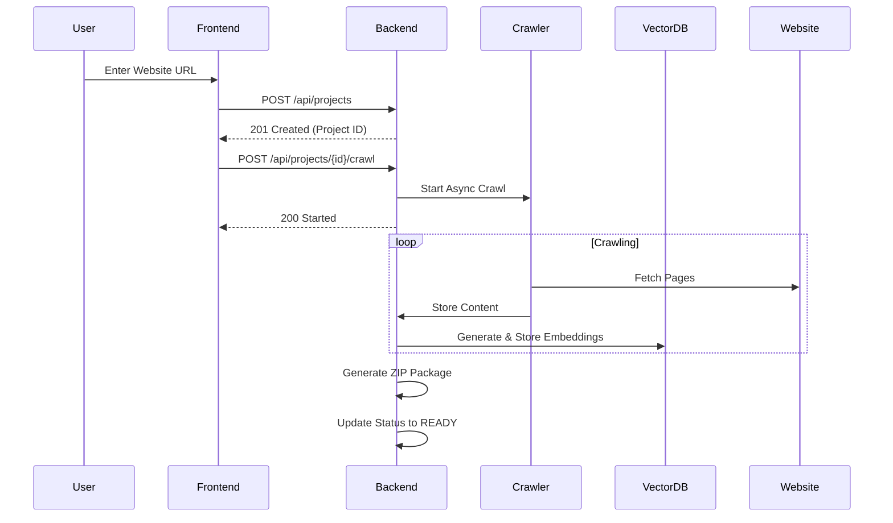
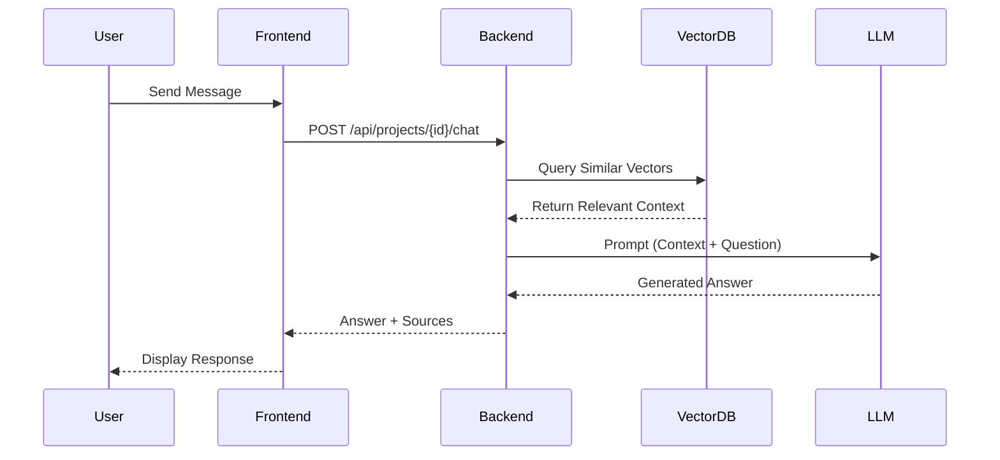

# 🏗️ System Architecture

## Overview

The **Instant Chatbot** platform is built using a modern decoupled architecture consisting of a Spring Boot backend, a Next.js frontend, and a PostgreSQL database with vector support.

## Component Breakdown

### 1. Backend (Spring Boot)
- **REST Layer**: Handles user authentication, project management, and chat interactions.
- **Crawl Service**: Orchestrates the extraction of content from user-provided URLs.
- **RAG Pipeline**: Integrates with Spring AI to generate embeddings, store them in a vector database, and retrieve relevant context for LLM generation.
- **Code Generator**: Packages the chatbot logic and frontend widget into a downloadable ZIP file.

### 2. Frontend (Next.js)
- **Dashboard**: A user-friendly interface for managing projects and monitoring crawl progress.
- **Chat Interface**: An interactive playground to test the generated chatbot.
- **Embeddable Widget**: A lightweight script that can be added to any website.

### 3. Data Layer
- **PostgreSQL**: Stores relational data (users, projects, crawl jobs).
- **PGVector**: Handles high-dimensional vector embeddings for semantic search.

## Sequence Diagrams

### Project Creation & Crawling

### Chat Interaction (RAG)

