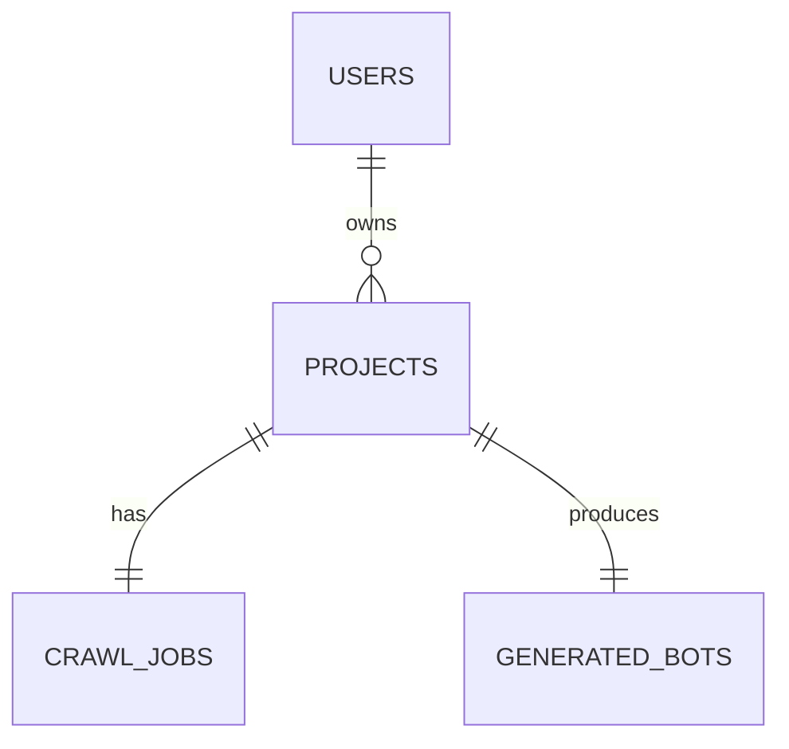

# 🗄️ Database Schema

The **Instant Chatbot** platform uses a PostgreSQL database. Below are the key tables and their relationships.

## Table: `users`
Stores user account and authentication information.

| Column | Type | Constraints | Description |
| :--- | :--- | :--- | :--- |
| `id` | `BIGINT` | `PRIMARY KEY`, `AUTO_INCREMENT` | Unique user identifier. |
| `email` | `VARCHAR` | `UNIQUE`, `NOT NULL` | User's email (login username). |
| `password` | `VARCHAR` | `NOT NULL` | BCrypt hashed password. |
| `name` | `VARCHAR` | `NOT NULL` | User's full name. |
| `created_at` | `TIMESTAMP` | `NOT NULL` | Account creation timestamp. |

---

## Table: `projects`
Stores project metadata and current processing status.

| Column | Type | Constraints | Description |
| :--- | :--- | :--- | :--- |
| `id` | `BIGINT` | `PRIMARY KEY`, `AUTO_INCREMENT` | Unique project identifier. |
| `name` | `VARCHAR` | `NOT NULL` | Project display name. |
| `website_url` | `VARCHAR` | `NOT NULL` | The URL to be crawled. |
| `status` | `VARCHAR` | `NOT NULL` | `PENDING`, `CRAWLING`, `READY`. |
| `user_id` | `BIGINT` | `FOREIGN KEY (users.id)` | Owner of the project. |
| `pages_found` | `INTEGER` | | Count of discovered pages. |
| `chunks_created` | `INTEGER` | | Count of semantic text chunks. |
| `created_at` | `TIMESTAMP` | | Project creation timestamp. |
| `updated_at` | `TIMESTAMP` | | Last update timestamp. |

---

## Table: `crawl_jobs` (Implicit in entities)
Tracks the specifics of a crawl task.

| Column | Type | Constraints | Description |
| :--- | :--- | :--- | :--- |
| `id` | `BIGINT` | `PRIMARY KEY` | Job identifier. |
| `project_id` | `BIGINT` | `FOREIGN KEY (projects.id)` | Associated project. |
| `status` | `VARCHAR` | | Process status. |

---

## Table: `vector_store` (Managed by PGVector)
While not a standard JPA table, PGVector creates a table (usually `vector_store` or similar depending on Spring AI config) to store embeddings.

| Column | Type | Description |
| :--- | :--- | :--- |
| `id` | `UUID` | Unique chunk identifier. |
| `content`| `TEXT` | The original text chunk. |
| `metadata`| `JSONB` | Source URL, headings, etc. |
| `embedding`| `VECTOR(1536)`| High-dimensional vector. |

## Relationships

